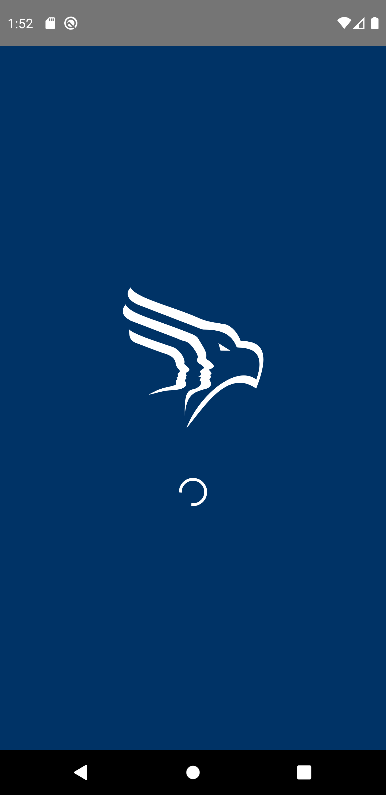
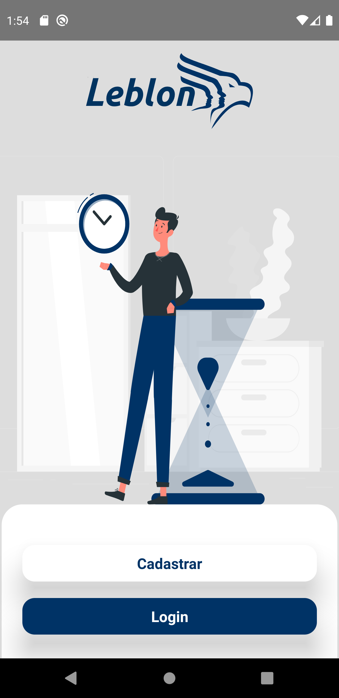
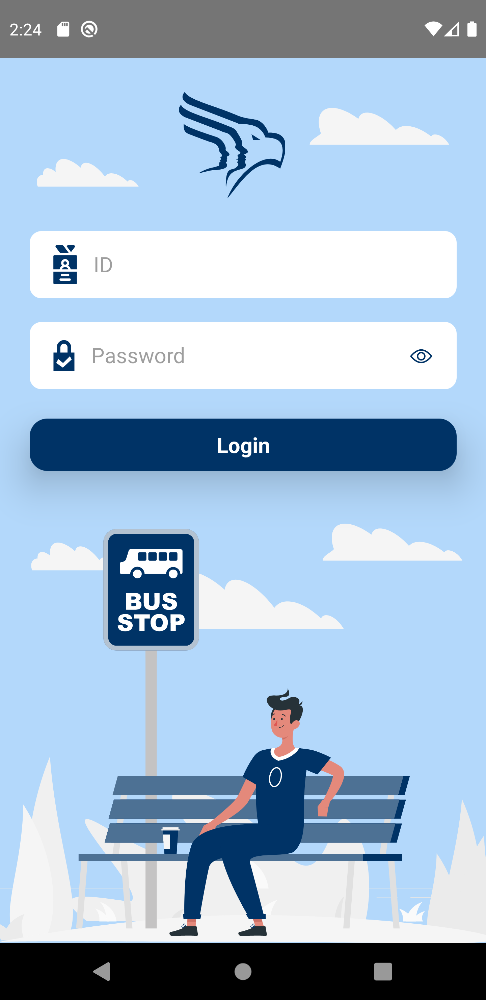
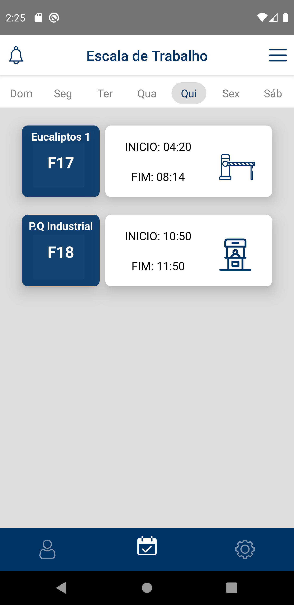

<h1 align="center"> 
    
</h1>


<h1 align='center'>

 


</h1>


## 📝Sobre

Aplicativo para visualização de escalas de trabalhos dos Cobradores e Motoristas do **Grupo Leblon de Transporte**

---
## 🚀 Tecnologias utilizadas:


O projeto foi desenvolvido utilizando as seguintes tecnologias:

- [React Navigation 5](https://reactnavigation.org/)
- [Redux](https://redux.js.org/)
- [React-Native-Svg](https://github.com/react-native-svg/react-native-svg)
- [Style-Components](https://styled-components.com/)

---
## 📦  Como baixar o projeto:

```bash
    
    # Clonar o repositório
    $ git clone https://github.com/chagas42/leblonApp

    # Entrar no diretório
    $ cd leblonApp

    # Instalar as dependências 
    $ npm install 

    # Iniciar o projeto
    $ npx react-native run-android
```
